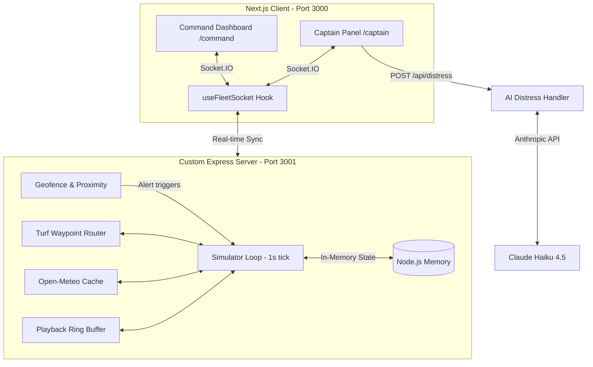

# 🚢 Fleet Command — Real-Time Maritime Fleet Command System

> **Code Rush Hackathon — Web Development Track**  
> *Time Limit: 4 Hours | Tech Stack: Next.js 14, Custom Express + Socket.IO Server, Leaflet, Turf.js, Anthropic SDK*

---

## 📌 Project Overview
Fleet Command is a real-time maritime tracking and directive system designed to monitor and manage a fleet of 15 commercial vessels navigating through the highly strategic **Strait of Hormuz / Persian Gulf region**. 

The system leverages a custom high-performance Node.js simulation engine to calculate continuous vessel positions, routing, geofence violations, vessel proximities, and weather conditions in real-time, syncing state seamlessly with interactive web interfaces for both **Command Headquarters** and **Vessel Captains** via Socket.IO.

---

## 🛠️ Technology Stack & Architecture
* **Core Framework**: `Next.js 14` (Pages Router) for frontend interfaces and fast rendering.
* **Real-Time Layer**: Custom `Express` + `Socket.IO @ 4` server (`server.js` at root) to run the simulation loop on a 1-second interval.
* **Map & Spatial Library**: `Leaflet @ 1.9` & `react-leaflet @ 4.2` for smooth map visualization with custom client-side marker interpolation.
* **Geo-Spatial Analysis**: `@turf/turf @ 6.5` for geofencing, restricted zones, point-in-polygon checks, and vessel-to-vessel proximity calculations.
* **AI Analysis**: `@anthropic-ai/sdk @ 0.20.9` with `claude-haiku-4-5-20251001` for structured JSON parsing of emergency distress transmissions.
* **Environment**: `Docker` & `Docker Compose` for seamless multi-port production-grade deployment.

---

## 🛑 Hard Rules & Constraints

1. **In-Memory Ship State**: No databases (Firebase/Firestore) are allowed in the hot path. All ship states live strictly in Node.js server memory.
2. **Strict Socket Sync**: Polling is banned. All real-time synchronizations must occur via persistent, bi-directional Socket.IO connections.
3. **App Router Restriction**: The Socket.IO server must NOT run on Next.js App Router API routes. It runs on a dedicated Custom Express Server (`server.js`).
4. **Step-by-Step Execution**: Do not build features out of order. Build and verify according to the designated Phases.
5. **No Placeholders**: Write fully functional, clean, and self-contained logic without stubbing out critical features.
